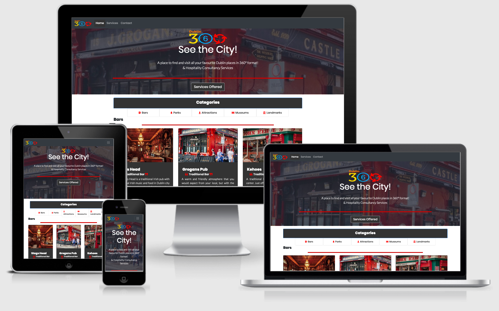

# Dublin-360-CI
Milestone 1 Project: Code Institute:

A Site to showcase 360 Degree Views of popular Dublin City tourist attractions and to showcase the hospitality skills and consultancy sercices available to hospitality customers from Dublin-360
 
## UX

- This project give the user a handy reference to visit Tourist Attractions safely fromt their home. They can also garner more information by going to the appropriate website. It's a one stop shop to escape and enjoy the many sights Dublin has to offer.
- The sights are broken down into Easily readible cards and sections. The user can navigate to each section from the main page.

- If a user is interestted in the services offered they can navigate to this via the navbar or a main button.
There is also a contact form available so they can either suggest a feature or enquire about services.
- In the contact form I can provide my Name, Email and select a topic and write a message and submit.

Link to conceptual Wireframe:
- https://dermomurphy.github.io/Dublin-360-CI/wireframe/Scan%2012%20May%202020.pdf

## Features

**Main Home Page** - Main Content Cards for Dublin Landmarks broken into sections with links to Each 360 image and website of the tourist atttraction.
Services Page - Media Card landscape style listing main features available with associated FA Icons alternating in style.
**Contact Page** - Main Contact form for Contacting Dublin-360 with message and topic area
 
### Existing Features
- **Links to Sections** - Quick Scrollable links to Each Category of Attraction
- **Featured Image** - Featured image on each Card for each attraction.
- **Link to 360 content** - 360 Degree Content on each card.
- **Link to appropriate website** - Each card has a link to appropriate website where applicable.
- **Contact Form**
- **Services Section**
- **Social Media Links** - Links to all social media content in footer.
- **Made With Bootrap** - Link in footer

### Features Left to Implement
- Using Matterport Host and implement own 360 images of all attractions in the city.

## Technologies Used

- [Bootstrap] (https://getbootstrap.com/)
    - Built with Bootstrap Twitter framework

- [JQuery](https://jquery.com)
    - The project uses **JQuery** to simplify DOM manipulation as part of Bootstrap Twitter framework
- [Popper] (https://www.npmjs.com/package/popper.js/v/1.14.3)
  - As Part of Bootstrap Twitter framerwork

## Testing
http://ami.responsivedesign.is/  Used to Test site across multiple viewports:
**Viewports**
Desktop
    1600x992px scaled down to scale(0.3181)
Laptop
    1280x802px scaled down to scale(0.277)
Tablet
    768x1024px scaled down to scale(0.219)
Mobile
    320x480px scaled down to scale(0.219) 

Testing done on VSCode Using Live server.- Mobile responsiveness also tested live

- All page/card/footer links were tested to open in seperate window.
- Navigation Buttons and Navbar links tested to navigate to specific pages.
- Various screen sizes also tested from large screen to mobile.
- Scrollable categories tested for each section.
- Services page - stacking of elements on smaller screens.
- Navbar Hamburger menu showing on mobile.

1. Contact form:
    1. Go to the "Contact Us" page
    2. Try to submit the empty form and verify that an error message about the required fields appears
    3. Try to submit the form with an invalid email address type and verify that a relevant error message appears
    4. Try to submit the form with all inputs valid and verify that a the form Success page message appears. PHP not allowed on GitHub so contact form only Front end only.

Media Queries Break Screens smaller than 860px:
- Icons on services page reduce 50% in size
- Main logo reduces 50% in size

Contact Form still needs to be connected to backend mailing system to receive data

## Deployment
Deployed using GitHub Pages accessed via the link below
 - https://dermomurphy.github.io/Dublin-360-CI/
 index.html is main content page - all other navigatable via this webpage

  **Process**
   1. Created a Github account at https://github.com My account: https://github.com/Dermomurphy

   2. Synced folder on local machine to Github Repo via VsCode: https://github.com/Dermomurphy/Dublin-360-CI

   3. To publish the project to see it on the web go to Settings on Repo , scroll down to the heading, GitHub Pages. Under the Source setting, Use drop-down menu to select master branch as a publishing source and save. Refreshed the github page, and you are then given a url where your page is published; The site is now published at 

    4. To run this code on your local machine, you would go to my respository at https://github.com/Dermomurphy/Dublin-360-CI and on the home page on the right hand side just above all the files, you will see a green button that says, "Clone or download", this button will give you options to clone with HTTPS, open in desktop or download as a zip file. Then --> 

    Open Git Bash
    CD to working directory to the location where you want the cloned directory to be made.
    Type git clone, and then paste this URL: https://github.com/Dermomurphy/Dublin-360-CI.git Press Enter. The clone is created.

    For more information about the above process; https://help.github.com/en/github/using-git/which-remote-url-should-i-use

## Credits

### Content
- Main Text Written by Dermot Murphy
- Some text for section Cards on Home was copied from [Wikipedia](https://en.wikipedia.org/wiki/) Descriptions
- Google Fonts for font styles; https://fonts.google.com/

### Media
- The photos used in this site were obtained from either Dermot Murphy or 
https://www.wikipedia.org/

### Acknowledgements

- https://www.wikipedia.org/

- Mentor Adegbenga Adeye:  for site layout inspiration, constructive advice. Github : https://github.com/deye9

- Code Institure : for instructional videos and Tutoring. https://codeinstitute.net/